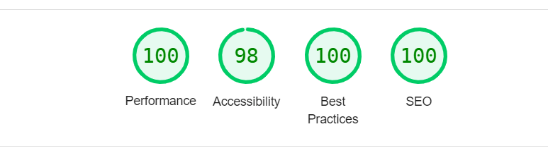

# Al3abplus

####

Arabic website for browser-based games. Powered by the React framework Next.js and Tailwind CSS.

&nbsp;

## 🎉 Live Site

[View Live](https://al3abplus.mostafaellethy.com/)

&nbsp;

## ✨ Features

<ul>
  <li>SEO optimized</li>
  <li>Fully responsive</li>
  <li>Assets optimized</li>
  <li>Pre-rendered pages (Static Site Generation)</li>
  <li>Incremental Regeneration</li>
  <li>Dockerized</li>
  <li>Game review</li>
  <li>Similar games</li>
  <li>Search</li>
  <li>Sitemap</li>
</ul>

&nbsp;

## 🚀 Performance



<sup>Scores calculated with Lighthouse 9.6.2.</sup>

&nbsp;

## Built With

- [React](https://reactjs.org/)
- [Next.js](https://nextjs.org/)
- [Typescript](https://www.typescriptlang.org/)
- [Tailwind CSS](https://tailwindcss.com/)
- [Prisma](https://www.prisma.io/)

&nbsp;

## Setup

```bash
# Install dependencies
$ npm install

# Compiles and hot-reloads for development
$ npm run dev

# Compiles and minifies for production
$ npm run build
```
